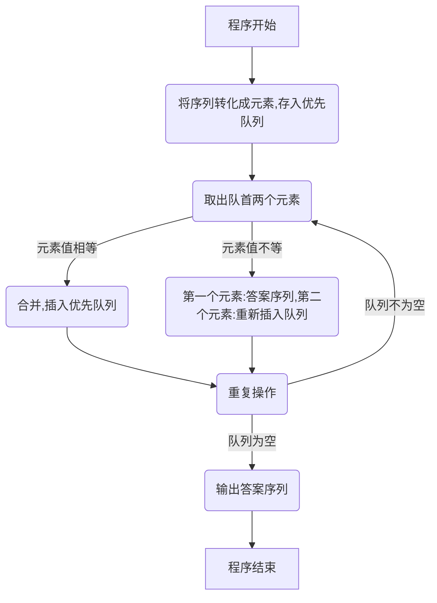

# Merge Equals 题解

## 题目大意

给定正整数序列 $a[1\dots N]$ ，每次你需要找到序列中出现次数 $>=2$ 的最小值 $x$ ，找到 $x$ 的 $2$ 个最小下标 $(i,j)$ ，删除 $a_i$，将 $a_j$ 改为 $2x$ 。反复进行如此操作，直到不能操作位置，求序列最终的形态。

## 解析

根据题意，我们知道我们要找的数，要满足以下条件：

```cpp
(1) 出现次数>=2
(2) 尽可能的小
```

对于条件2，我们很容易的想到用小根堆维护，也就是优先队列。但是题目中还需要用到这个数的下标，所以很容易想到维护点对 $pair(x,pos)$ ，其中 $x$ 表示值， $pos$ 表示 $x$ 在原数组中的位置。

我们把样例中数据排个序，得到的结果是：

$[1,3],[1,6],[1,7],[2,4],[2,5],[3,1],[4,2]$。很明显，我们要合并开头的两个数。

从刚才的例子中可以发现，**我们每次取数，只需要处理开头的两个元素即可**。我们就对开头的两个元素进行分类讨论：（设开头的两个元素分别为 $[x_1,p_1]$ 和 $[x_2,p_2]$ ，且 $x_1\leqslant x_2$）

（1） $x_1=x_2$

这种情况很简单，我们把 $[2x_1,p_2]$ 放入队列中即可。

（2）$x_1\ne x_2$

由于 $x_1\leqslant x_2$ ，且 $x_1\ne x_2$ ，可得 $x_1<x_2$ 。又因为 $x_1$ 和 $x_2$ 是优先队列中最小的数，所以 $x_1$ **不会找到跟他相等的数**，所以直接把 $x_1$ 放入答案序列中即可， $x_2$ 则要重新放回队列。

最后，在答案序列中输出即可。这里可能会碰到一个问题：因为之前的优先队列是根据**元素值**进行排序的，也就是说，**数组下标**可能是无序的。但是输出答案序列的时候，我们要求数组下标是**有序**的。所以，我们还可以新开一个优先队列，并让**下表位置**作为第一关键字即可。

## 算法流程



## 代码

```cpp
#include <bits/stdc++.h>
#define int long long
using namespace std;
inline int read(){
	int s = 0, w = 1;
	char ch = getchar();
	for(; ch < '0' || ch > '9'; w *= (ch == '-') ? -1 : 1, ch = getchar());
	for(; ch >= '0' && ch <= '9'; s = 10 * s + ch - '0', ch = getchar());
	return s * w;
}
int n;
priority_queue<pair<int, int>, vector<pair<int, int> >, greater<pair<int, int> > > pq;
priority_queue<pair<int, int>, vector<pair<int, int> >, greater<pair<int, int> > > ans;
signed main(){
	n = read();
	for(int i = 0; i < n; i++){
		int tmp = read();
		pq.push(make_pair(tmp, i));
	}
	while(pq.size() > 1){
		pair<int, int> a, b;
		a = pq.top(), pq.pop();
		b = pq.top(), pq.pop();
//		printf("(%d,%d) (%d,%d)\n", a.first, a.second, b.first, b.second);
		if(a.first == b.first){
//			printf("push(%d, %d)\n", a.first * 2, b.second);
			pq.push(make_pair(a.first * 2, b.second));
		} else {
			pq.push(b);
			ans.push(make_pair(a.second, a.first));
		}
	}
	ans.push(make_pair(pq.top().second, pq.top().first));
	cout << ans.size() << endl;
	while(!ans.empty()){
		pair<int, int> now = ans.top();
		ans.pop();
		cout << now.second << " ";
	}
	return 0;
}
```